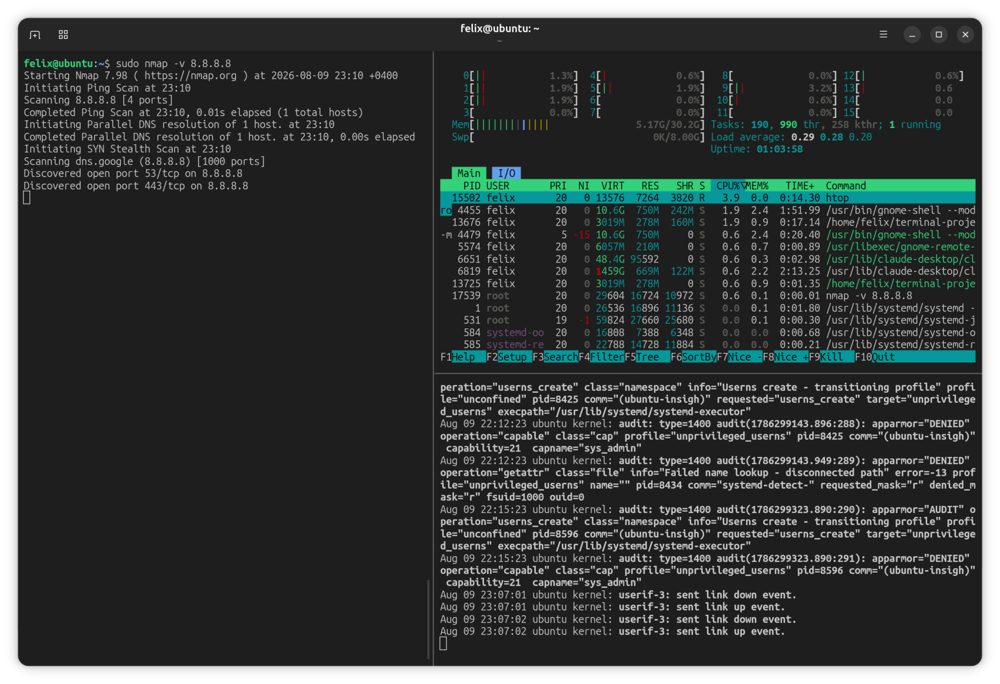
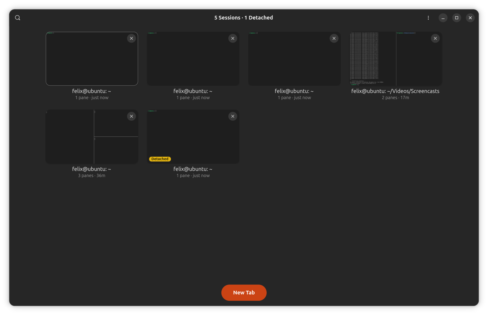
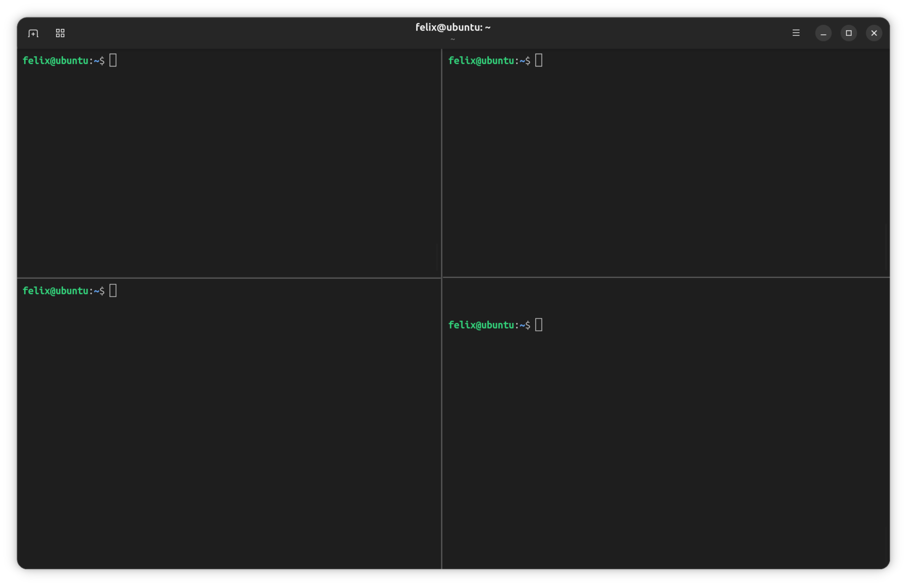
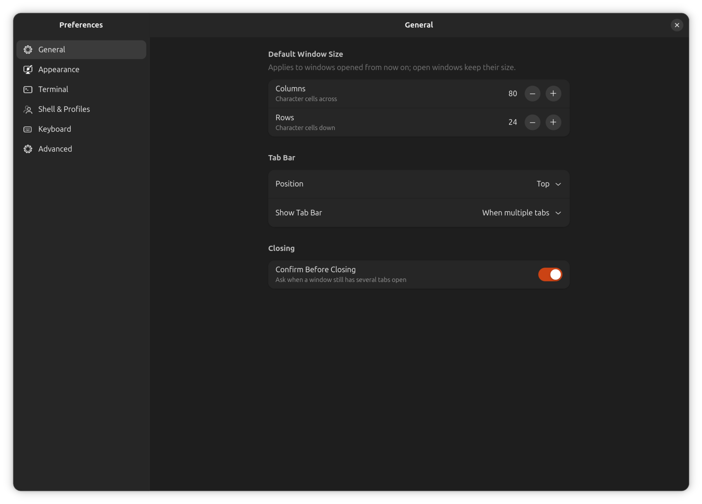

<div align="center">


# Epimone Terminal

### The terminal that never loses your work.

Close the window. Crash the app. Log out and come back tomorrow.
Your shells are still running, right where you left them.


<br/>

<!-- ============================================================
     HERO SHOT
     Main window, one tab split into 2-3 panes, default Epimone
     palette, something alive in each pane (htop, a log, a shell).
     First impression. Make it beautiful.
     ============================================================ -->


</div>

---

## What Makes Epimone Terminal Special?

Most terminals tie a session's life to its window. Close the tab and the job dies with it. You start
something long, a build, a scan, six hours of hashcat, then close the wrong window or hit a crash,
and it's gone. Anyone who lives in a terminal knows that sinking feeling.

tmux solves it, but you have to live inside tmux: keyboard prefixes, no real GUI, a wall to climb.
Epimone Terminal gives you the same safety net inside a normal graphical terminal you already know
how to use. A small background daemon owns your real sessions and their scrollback. The window is
just a view. Kill it and your work doesn't even flinch.

<br/>

## Key Features

- **Persistent sessions.** A background daemon holds every PTY and its scrollback. Close the window
  or crash the GUI and nothing dies. Reattach and everything is still running.
- **Session overview.** A grid of every session, attached or detached, with live thumbnails of each
  tab's real split layout. Click to restore the whole arrangement.
- **Real tiling splits.** A proper split tree, any direction, nested as deep as you like, with pane
  zoom and drag-to-resize.
- **Whole-window theming.** Fifteen palettes that recolor the entire app, not just the text area.
  Light and dark, following your system accent.
- **No dotfile edits.** Ships its own bash and zsh integration, injected at launch, so new tabs and
  splits inherit the current directory.
- **Rebindable shortcuts.** Fourteen configurable keys with conflict detection.
- **Native GNOME app.** GTK4 and libadwaita, fast and clean.

<br/>

## Never Lose a Session

Here's the demo that says everything. Split a pane, start `ping` in it, close the entire tab, then
reopen it. The ping is still counting. It never stopped, because it was never the window's to stop.
It belongs to the daemon.

<!-- ============================================================
     THE MONEY GIF
     Split a tab, run `ping 8.8.8.8`, close the whole tab, open
     the overview, click its card, tab restores with ping STILL
     CLIMBING (make the icmp_seq jump visible). This one GIF sells
     the whole project. Spend time getting it right.
     ============================================================ -->
<p align="center">
  
</p>

Closing anything only detaches it. Nothing dies unless the shell exits on its own or you kill it on
purpose. That accidental close on a six-hour job stops being a disaster and becomes a shrug.

> The one thing persistence can't beat is a reboot. Power off and the running processes go with the
> RAM. Everything short of that survives.

<br/>

## Session Overview

Every session you have, attached or detached, in one grid. Each card is a live thumbnail of the real
split layout of that tab, an actual picture of the panes, not a text preview. Click a card and the
whole arrangement returns exactly as you left it: same splits, same ratios, same processes still
running.

<!-- ============================================================
     SESSION OVERVIEW
     The overview grid full of cards. Include a few tabs split
     into multiple panes so the composite thumbnails show off.
     Most striking view in the app.
     ============================================================ -->
<p align="center">
  
</p>

Detached sessions any other terminal would have thrown away sit right there, one click from restored,
or gone if you want them gone.

<br/>

## Tiling Splits

A real split tree, not a plugin bolted on the side. Split any direction, nest as deep as you like,
drag to resize, and zoom any pane to fullscreen and back. All from the keyboard, with clean hairline
dividers that stay out of your way.

<!-- ============================================================
     SPLITS
     One tab tiled into 3-4 panes running different things (htop,
     tail -f, a shell, vim). Show the hairline dividers and that
     it handles real work, not a toy 2-pane demo.
     ============================================================ -->
<p align="center">
  
</p>

<br/>

## Pane Zoom

Working in one pane of a busy layout? Zoom it to fill the tab, do your thing, unzoom, and every other
pane is exactly where you left it. The split tree never changes underneath you.

<!-- ============================================================
     PANE ZOOM
     One pane zoomed to fill the tab with the zoom indicator
     visible. Before/after pair also works if you want it.
     ============================================================ -->
<p align="center">
  
</p>

<br/>

## Themes

Fifteen bundled palettes, and each recolors the entire window, terminal and chrome together, the way
a native app should. Light and dark both look right, and the window rides your system accent color.

<!-- ============================================================
     THEME GALLERY (Ptyxis-style showcase)
     Same layout shot in several palettes. Drop each into the
     table below. Suggested six: Epimone, Dracula, Nord, Gruvbox,
     Solarized Dark, Solarized Light.
     ============================================================ -->

<table>
  <tr>
    <td align="center">
      <br/>
      <sub><b>Epimone</b></sub>
    </td>
    <td align="center">
      <br/>
      <sub><b>Dracula</b></sub>
    </td>
    <td align="center">
      <br/>
      <sub><b>Nord</b></sub>
    </td>
  </tr>
  <tr>
    <td align="center">
      <br/>
      <sub><b>Gruvbox</b></sub>
    </td>
    <td align="center">
      <br/>
      <sub><b>Solarized Dark</b></sub>
    </td>
    <td align="center">
      <br/>
      <sub><b>Solarized Light</b></sub>
    </td>
  </tr>
</table>

<br/>

## Preferences

A full settings window: shell and profile, scrollback, cursor, fonts, padding, and fourteen
rebindable keyboard shortcuts with conflict detection that names the action already using a key
before you reassign it.

<!-- ============================================================
     SETTINGS
     Preferences window open on the Appearance or Keyboard page,
     showing the sidebar layout and the palette grid or shortcut
     list.
     ============================================================ -->
<p align="center">
  
</p>

<br/>

## Built for Developers and Pentesters

Epimone Terminal ships its own bash and zsh integration (OSC 7 and OSC 133), injected at launch, so
new tabs and splits open in the current directory without you ever editing your `~/.bashrc`.

It's aimed at Linux developers, and at pentesters on Kali and Parrot, where a dropped shell in the
middle of an engagement can cost hours. The whole design starts from one promise: your session
outlives the window.

<br/>

## Status

In active development toward 1.0. The core is done and daily-drivable right now: tabs, splits, the
persistence daemon, live session restore, the session overview, full settings, and whole-window
theming. Named workspaces, broadcast input, and packaging are on the way.

<br/>

## Install

Epimone Terminal uses the [Meson](https://mesonbuild.com/) build system.

You'll need a C compiler (GCC or Clang), Meson, Ninja, GTK 4, libadwaita 1.5 or newer, VTE (the
GTK 4 build), and GLib. On Debian, Ubuntu, Kali, or Parrot:

```sh
sudo apt install build-essential meson ninja-build \
    libgtk-4-dev libadwaita-1-dev libvte-2.91-gtk4-dev libglib2.0-dev
```

Build and run:

```sh
git clone https://github.com/flxdevlab/epimone-terminal.git
cd epimone-terminal
meson setup build
meson compile -C build
./build/epimone
```

Install system-wide:

```sh
sudo meson install -C build
```

The daemon starts on its own when you launch the app. You never run it by hand.

<br/>

## How It Works

Three parts talking over a small protocol on a UNIX socket.

The daemon is plain C, nothing beyond libc. It owns the PTYs, keeps a scrollback ring buffer per
session, and stays alive when the GUI goes away. It never links GTK. It just holds terminals.

The GUI is GTK4, libadwaita, and VTE. It attaches to daemon sessions over a local-PTY bridge, so VTE
gets a real terminal while the daemon stays the true owner. That bridge is what lets a session
outlive its window.

`epimone-ctl` is a command-line client for listing, attaching to, and managing sessions directly.

<br/>

## Contributing

Epimone Terminal is free and open-source software. Issues and merge requests are welcome. When you
file a bug, include your distro, desktop, and GTK and VTE versions.

<br/>

## Credits

Epimone Terminal owes two projects in particular.

[Ptyxis](https://gitlab.gnome.org/chergert/ptyxis) by Christian Hergert was the reference for a
clean, modern GTK4 and libadwaita terminal. Epimone Terminal's GUI and its whole-window palette
theming were shaped by studying how Ptyxis does it.

[tmux](https://github.com/tmux/tmux) is where the persistence model comes from. The idea that a
terminal session should outlive whatever is showing it is tmux's, rebuilt here as a native GUI
instead of a multiplexer you drive by keyboard prefix.

Built with [GTK](https://gtk.org), [libadwaita](https://gitlab.gnome.org/GNOME/libadwaita), and
[VTE](https://gitlab.gnome.org/GNOME/vte).

## License

Epimone Terminal is licensed under the GNU General Public License v3.0 or later (GPL-3.0-or-later).
See [`LICENSE`](LICENSE) for the full text.
