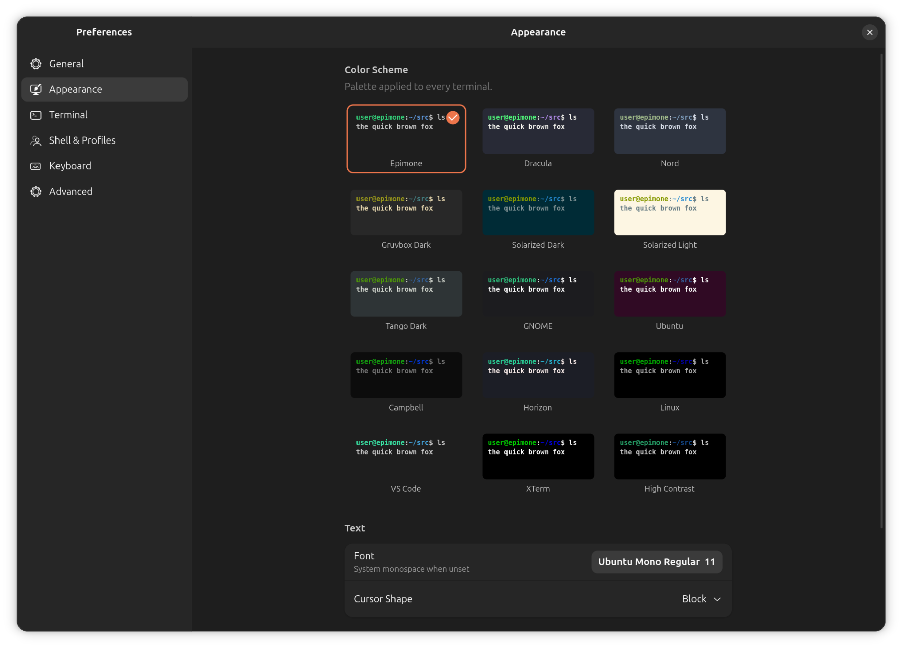

<div align="center">


# Epimone Terminal

### The terminal that keeps running after you close the window.

Close the window. Crash the GUI. Your shells keep running in the background,
right where you left them, until you reattach.


</div>

---

*Epimone (pronounced eh-PIM-o-nee) is a rhetorical device: the persistent repetition of a phrase, question, or single point to keep the focus on one central idea. It comes from the Greek epi (upon) and mone (tarrying, or staying). A terminal that refuses to let go of your session while it is running felt like the right thing to name after it.*

## What makes it different

Most terminals tie a session's life to its window. Close the tab and the job dies with it. You start something long, a build, a scan, six hours of hashcat, then close the wrong window or the GUI crashes, and it's gone. Anyone who lives in a terminal knows that feeling.

tmux solves it, but you have to live inside tmux: keyboard prefixes, no real GUI. Epimone gives you the same safety net inside a normal graphical terminal you already know how to use. A background daemon owns your real sessions and their scrollback. The window is just a view onto them. Close the view and the sessions keep running.

To be clear about the boundary: this survives closing the window and the GUI crashing, because the daemon stays alive in the background. It does not survive a logout or a reboot. When the machine powers off, the running processes go with it, same as anything else. What Epimone protects against is the accidental close and the crash, not the power cut.

## Features

- **Sessions that outlive the window.** A background daemon holds every PTY and its scrollback. Close the window or crash the GUI and the shells keep running. Reopen and reattach, and everything is still going.
- **Session overview.** A grid of every session, attached or detached, with live thumbnails of each tab's real split layout. Click to restore the whole arrangement.
- **Real tiling splits.** A proper split tree, any direction, nested as deep as you want, with pane zoom and drag to resize.
- **Whole-window theming.** Fifteen palettes that recolor the entire app, not just the text area. Light and dark, following your system accent.
- **No dotfile edits.** Ships its own bash and zsh integration, injected at launch, so new tabs and splits inherit the current directory.
- **Rebindable shortcuts.** Fourteen configurable keys with conflict detection.
- **Native GNOME app.** GTK4 and libadwaita.

## Never lose a running session

Here is the demo that says everything. Split a pane, start `ping` in it, close the whole window, then reopen it. The ping is still counting. It never stopped, because it was never the window's to stop. It belongs to the daemon.

<div align="center">
  <video src="https://github.com/flxdevlab/epimone-terminal/raw/main/docs/screenshots/persistence.mp4" width="820" controls autoplay loop muted></video>
</div>

Closing the window only detaches it. Nothing dies unless the shell exits on its own, you kill it on purpose, or the machine shuts down. That accidental close on a six-hour job stops being a disaster.

> The boundary is the machine itself. A logout or a reboot takes the running processes with it, because they live in RAM. Everything short of powering down survives.

## Session overview

Every session you have, attached or detached, in one grid. Each card is a live thumbnail of the real split layout of that tab, an actual picture of the panes, not a text preview. Click a card and the whole arrangement comes back exactly as you left it: same splits, same ratios, same processes still running.


Detached sessions that any other terminal would have thrown away sit right there, one click from restored, or gone if you want them gone.

## Tiling splits

A real split tree, not a plugin bolted on the side. Split any direction, nest as deep as you want, drag to resize, and zoom any pane to fullscreen and back. All from the keyboard, with clean hairline dividers.


## Themes

Fifteen bundled palettes, and each one recolors the entire window, terminal and chrome together. Light and dark both look right, and the window follows your system accent color.



## Preferences

A full settings window: shell and profile, scrollback, cursor, fonts, padding, and fourteen rebindable keyboard shortcuts with conflict detection that names the action already using a key before you reassign it.


## Built for developers and pentesters

Epimone ships its own bash and zsh integration (OSC 7 and OSC 133), injected at launch, so new tabs and splits open in the current directory without you ever editing your `~/.bashrc`.

It is aimed at Linux developers, and at pentesters on Kali and Parrot, where a dropped shell in the middle of an engagement can cost hours. The whole design starts from one idea: your session should outlive the window showing it.

## Status

In active development toward 1.0. The core is done and daily-drivable right now: tabs, splits, the persistence daemon, live session restore, the session overview, full settings, and whole-window theming. Named workspaces, broadcast input, and packaging are on the way.

## Install

Epimone uses the [Meson](https://mesonbuild.com/) build system.

You need a C compiler (GCC or Clang), Meson, Ninja, GTK 4, libadwaita 1.5 or newer, VTE (the GTK 4 build), and GLib. On Debian, Ubuntu, Kali, or Parrot:

```
sudo apt install build-essential meson ninja-build \
    libgtk-4-dev libadwaita-1-dev libvte-2.91-gtk4-dev libglib2.0-dev
```

Build and run:

```
git clone https://github.com/flxdevlab/epimone-terminal.git
cd epimone-terminal
meson setup build
meson compile -C build
./build/epimone
```

Install system-wide:

```
sudo meson install -C build
```

The daemon starts on its own when you launch the app. You never run it by hand.

## How it works

Three parts talking over a small protocol on a UNIX socket.

The daemon is plain C, nothing beyond libc. It owns the PTYs, keeps a scrollback ring buffer per session, and stays alive when the GUI goes away. It never links GTK. It just holds terminals.

The GUI is GTK4, libadwaita, and VTE. It attaches to daemon sessions over a local-PTY bridge, so VTE gets a real terminal while the daemon stays the true owner. That bridge is what lets a session outlive its window.

`epimone-ctl` is a command-line client for listing, attaching to, and managing sessions directly.

## Contributing

Epimone is free and open-source software. Issues and pull requests are welcome. When you file a bug, include your distro, desktop, and GTK and VTE versions.

## Credits

Epimone owes two projects in particular.

[Ptyxis](https://gitlab.gnome.org/chergert/ptyxis) by Christian Hergert was the reference for a clean, modern GTK4 and libadwaita terminal. Epimone's GUI and its whole-window palette theming were shaped by studying how Ptyxis does it.

[tmux](https://github.com/tmux/tmux) is where the persistence model comes from. The idea that a terminal session should outlive whatever is showing it is tmux's, rebuilt here as a native GUI instead of a multiplexer you drive by keyboard prefix.

Built with [GTK](https://gtk.org), [libadwaita](https://gitlab.gnome.org/GNOME/libadwaita), and [VTE](https://gitlab.gnome.org/GNOME/vte).

## License

Epimone is licensed under the GNU General Public License v3.0 or later (GPL-3.0-or-later). See [LICENSE](LICENSE) for the full text.
